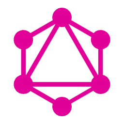
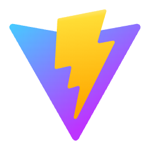
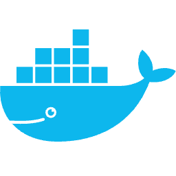

<h1 align="center"> Hey, I'm Xenia 👋 </h1>

 I'm a Frontend Developer from Ukraine 🇺🇦  

 
 With the wisdom of&nbsp; ${\color{#70a5fd}\textsf{Yoda}}$ and the determination of a&nbsp; ${\color{#70a5fd}\textsf{Jedi}}$, 
  I tackle the challenges of the frontend universe

 &nbsp; ${\color{#70a5fd}\textsf{Let's connect:}}$

  
  
  

 
 

&nbsp; ${\color{#70a5fd}\textsf{Here're some thing I've been working with lately:}}$

    &nbsp;
    &nbsp;
    &nbsp;
    &nbsp;
    &nbsp;
    &nbsp;
    &nbsp;
    &nbsp;
    

  &nbsp;
  &nbsp;
  &nbsp;
  &nbsp;
  &nbsp;
  &nbsp;
  &nbsp;
  &nbsp;
   

 
 

### ⚙️ GitHub Analytics

 

&nbsp; ${\color{LightBlue}\textsf{May the Force be with you}}$ 

<!--
